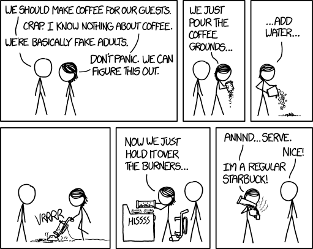

# Welcome

Day 1      |            
--------|-------------
900- 930| Introductions        
930-1000| R, Rstudio, Git, Github 
1000-1100| Introduction to R
1100-1200| Git for Science!  
1130-1300| Q&A and lunch    
1300-1330| ISCN: SOC-DRaHR and soilDataR 
1330-1600| Group exercise: data ingest 
1600-1700| Recap 
 
 \tiny
 
  Day 2      |     
 ------------|------------
  900- 930 | Recap group walk through
  930-1000 | Digest code review
 1000-1030 | Brainstorm and organize
 1030-1200 | Hack!
 1200-1245 | Q&A and lunch
 1300-1430 | Seminar
 1430-1600 | Hack!
 1600-1700 | Push, pull-requests, and closeout
  
  \normalsize
  
# Workshop logistics

> In the interest of fostering an open and welcoming environment, we as contributors and maintainers pledge to making participation in our project and our community a harassment-free experience for everyone, regardless of age, body size, disability, ethnicity, gender identity and expression, level of experience, education, socio-economic status, nationality, personal appearance, race, religion, or sexual identity and orientation.

-Code of Conduct adapted from the Contributor Covenant vs1.4

https://github.com/ISCN/SOC-DRaHR/blob/master/CODE_OF_CONDUCT.md

- Bathroom location
- Emergency exits
- Post-it notes

# Hi!
  
  1. Who are you? (Name, R/Git experience)
  2. Why are you here?
  3. How do you take your coffee/tea/beverage of choice?
  
  { width=50% }


# Workshop Goal

- Integrate C-PEAT data with ISCN
- Connect informatics and soil science

# Install

\small

https://swcarpentry.github.io/workshop-template/#Setup

\Large

# Data cleaning for R

## Why script data cleaning (with R or Python)?
    - Data is gold
    - Easy to modify analysis
    - Easy to share and reproduce
    - Hooks to analysis and visualization
    
## Why not to script data cleaning?
    - Time/skills
    
# Rstudio vs R
    - Layout of Rstudio
    - What is a 'project' in Rstudio
    - How is R different then Rstudio?

\normalsize

# Scripts are a series of commands
```{r}
#let's create some points
myPoints <- data.frame(x=1:50, y=(1:50)*0.5+2)

#let's look at the first few data entries
print(head(myPoints))
```

# Functions are a collection of commands
\normalsize
```{r}
makeMyLine <- function(x=1:10){
  y <- x * 0.5 + 2
  return(y)
}

same_x <- data.frame(x=1:50, y=makeMyLine(x=1:50))
```

# Plots with ggplot2
```{r fig.height=4}
library(ggplot2)

ggplot(same_x) +
  geom_line(aes(x=x, y=y), color='red') + 
  geom_point(data=myPoints, aes(x=x, y=y))
```

# Tidyverse grammer
```{r echo=FALSE}
suppressMessages(library(tidyverse))
```
The tidyverse package is very useful for data cleaning because it simplifies code.

```{r fig.height=3}
library(tidyverse)
myPoints %>% 
  head %>% 
  print #same as print(head(x))
```

# Rmarkdown

- Combine text with executable code and outputs with Rmarkdown or Jupyter Notebooks.
- Rmarkdown is built into Rstudio so we'll use that for this workshop.

# Things to remember about programming
- _Google is your friend._
- When in doubt, try it. You (probably) won't break your computer.
- Never work with the only copy of the data file.
- Save frequently, also backup.

# Git

{height=55%}

# Git vs GitHub

- Git is a version control software
- Git hub is a public git repository with a GUI and some basic project management tools.

Does everyone have a github account?

# Creating a git repository

- \texttt{git init}
- \texttt{git clone}
- Forking a repository

# Tracking changes with git

1) Make changes on your local copy.
2) Tell your local repository that you want to bundle changes together.
3) Make a comment on those changes
4) Push those changes to a remote copy of your repository for other people.
5) Pull changes from the remote copy that other people have made to your local copy.

# When things go badly

- Merge conflicts
- Rolling back changes

# SOC-DRaHR and soilDataR

- International Soil Carbon Network 
    + connecting soils scientists to leverage data across sites
    + develope harmonized data products
- Soil organic carbon data rescue and harmonization repository
    + https://github.com/ISCN/SOC-DRaHR
    + Main repository for data staging
- soilDataR
    + https://github.com/ISCN/soilDataR
    + utilities to support SOC-DRaHR and production of ISCN data products
